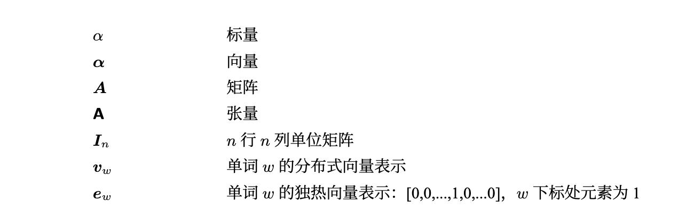
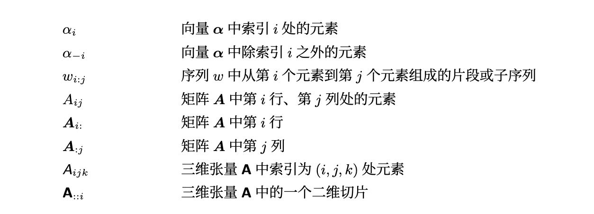
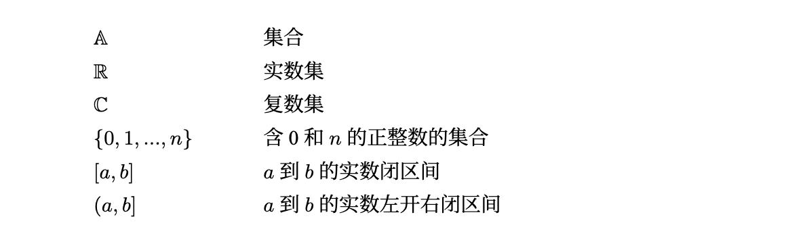
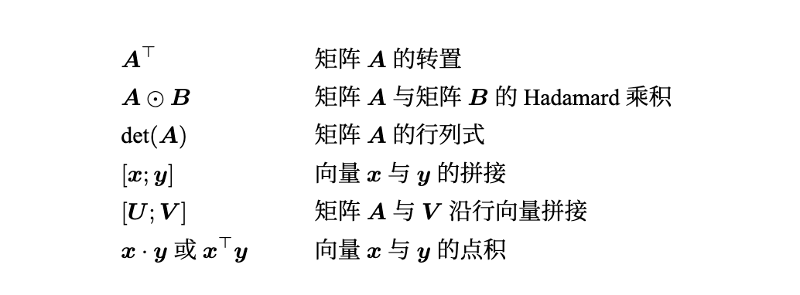
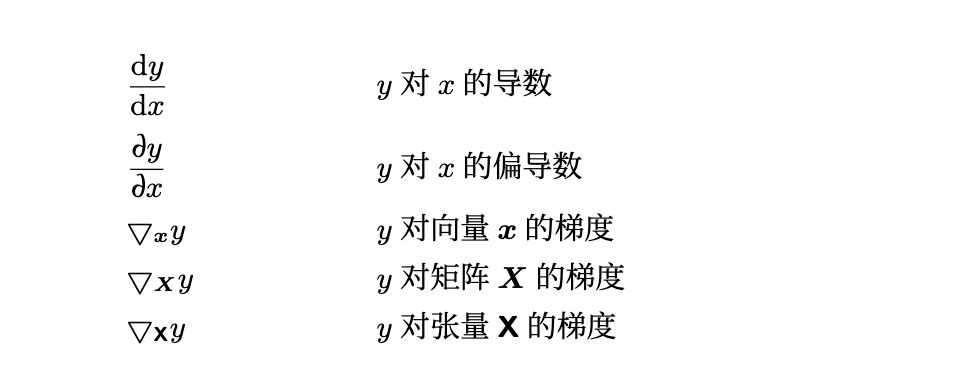
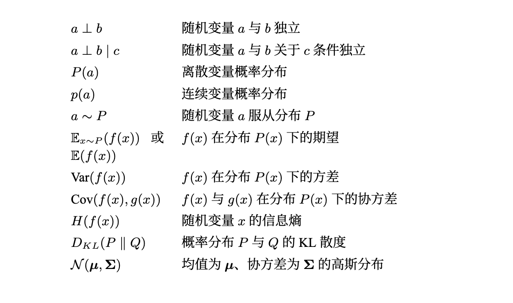
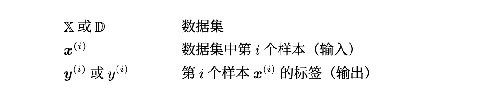
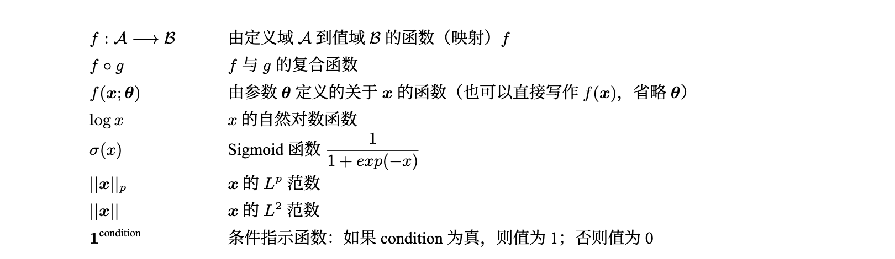
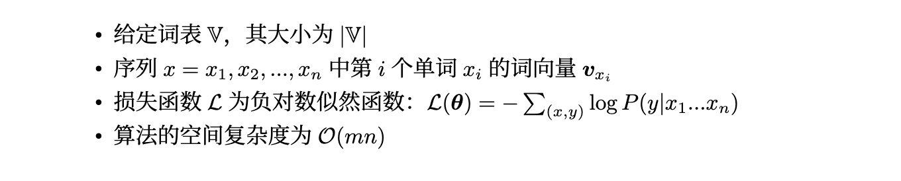

# 绪论

> 写在开头, github 对 latex 支持不太好, 提供了 pdf 版供您查看

## 数学基础

### 数与数组

+ **标量 (Scalar)**：

   - 定义：标量是一个单一的数值，不带方向。
   - 举例：温度、体积、质量等都可以被表示为标量。
   - 属性：标量只有大小，没有方向。

+ **向量 (Vector)**：

   - 定义：向量是具有大小和方向的量。在数学中，它通常由一组有序的数值组成，并可以表示为一个箭头，其中箭头的长度代表大小，方向代表其方向。

   - 举例：速度、加速度、力都是向量，因为它们都有大小和方向。

   - 属性：向量有n个分量，在二维空间中它有两个分量（例如x和y），在三维空间中它有三个分量（x、y和z）。

   - 向量可以用矩阵表示

     > 一个向量 v 在二维空间中通常可以表示为：
     >
     > $$ \mathbf{v} = \begin{bmatrix} v_x \\ v_y \end{bmatrix} $$ 
     >
     > 在三维空间中为：
     >
     > $$ \mathbf{v} = \begin{bmatrix} v_x \\ v_y \\ v_z \end{bmatrix} $$
     >
     > 向量的方向通常由它的方向角来描述。在二维空间中，方向角是与正x轴之间的角。在三维空间中，还可以有与xy平面的夹角或与某个特定坐标轴的夹角。
     >
     > 对于二维空间，向量 v 的方向角 *θ* 可以通过其分量计算：
     >
     > $$ \theta = \tan^{-1}\left(\frac{v_y}{v_x}\right) $$
     >
     > 在三维空间中，情况稍微复杂一些，但基本的概念相似。你可以使用类似的方法来描述向量与坐标轴的夹角。
     >
     > 要注意的是，当我们说“方向”时，我们通常指的是一个无大小的概念，只关心向量“指向哪里”，而不关心它有多长。而当我们规范化一个向量时，我们得到一个所谓的`单位向量`，它在同一方向上，但其长度为1。

+ **张量 (Tensor)**：

   - 定义：张量是一个更为广泛的概念，可以被认为是标量、向量和更高维结构的泛化。

   - 属性：张量的一个关键属性是其"阶"（或"秩"）。标量是零阶张量，向量是一阶张量，矩阵是二阶张量。三阶张量可以被想象为一个数据立方体，但张量可以是任意阶的。

   - 本质可以描述为一个多维数字数组

   - 举例：

     > 图像数据通常被表示为一个4D张量：[批次大小, 高度, 宽度, 颜色通道]。
     >
     > 在物理学中，应力张量用于描述物体上的力的分布；
     >
     > 在深度学习中，张量是用于存储多维数据的主要数据结构，例如RGB图像可以被看作一个三阶张量。

+ **单位矩阵 (Identity Matrix)**：

   - 定义：单位矩阵是一个方阵，其中对角线上的元素都为1，而其它元素都为0。

   - 符号：通常用大写字母I表示。

   - 属性：对于任意矩阵A，当与单位矩阵相乘时，结果仍然是A，即 AI = IA = A。

   - 举例：

   $$ \begin{bmatrix} 1 & 0 & 0 \\ 0 & 1 & 0 \\ 0 & 0 & 1 \\ \end{bmatrix} $$

   

+ **分布式向量 (Distributed Vector)**

   - 又称为词嵌入 (word embeddings)。

   - 是将词汇映射到一个连续的向量空间中，每个维度都有具体的语义含义。

   - 常见的词嵌入模型包括 Word2Vec、GloVe 和 FastText。

   - 分布式向量捕获了词汇之间的语义关系。例如，相似的词汇在这个空间中可能会靠得很近。

   - 向量的维度通常远小于词汇表的大小，并且是固定的（如 50、100、200、300 维）。

   - 用一个具体的列子描述 分布式向量 : 

     > 假设我们有以下句子：
     >
     > 1. 猫喜欢吃鱼。
     > 2. 狗喜欢吃骨头。
     > 3. 猫经常捉老鼠。
     > 4. 狗喜欢追猫。
     >
     > 如果我们使用一个简化的词嵌入模型（如 Word2Vec）对这些句子进行训练，我们可能会得到每个词的分布式向量。这些向量会在一个多维空间中表示每个词的“含义”。
     >
     > 假设我们的向量是2维的（实际应用中的向量通常有更高的维度，例如100、200或300维），那么这些词的向量表示可能如下：
     >
     > - 猫: [0.7, 0.2]
     > - 狗: [0.6, 0.3]
     > - 喜欢: [0.1, 0.9]
     > - 吃: [0.2, 0.8]
     > - 鱼: [0.5, 0.1]
     > - 骨头: [0.4, 0.1]
     > - 捉: [0.9, 0.3]
     > - 老鼠: [0.8, 0.2]
     >
     > 从这个模拟中，我们可以观察到：
     >
     > 1. “猫”和“狗”的向量在空间中比较接近，表示它们在语义上有相似性，这是因为它们都与“喜欢”和“吃”有关。
     > 2. “鱼”和“骨头”的向量也接近，表示它们都是某种食物。
     > 3. “捉”和“老鼠”的向量也相对接近，因为它们经常在相同的语境中出现。
     >
     > 这只是一个简化的模型，实际的分布式向量会捕捉到更加复杂和细微的语义关系。在这样的空间中，通过词向量之间的相似性，我们可以推断出词语之间的语义关系，如找到最相似的词、进行词的类比等。

+ **独热向量 (One-hot Vector)**

   - 是表示分类变量的经典方法。对于每一个词汇，独热向量中该词汇的索引位置为1，其他位置为0。
   - 假设有一个大小为 N 的词汇表，那么每个词汇的独热向量的维度都是 N。
   - 例如，对于词汇表 ["apple", "banana", "cherry"]，"apple" 的独热表示为 [1, 0, 0]，"banana" 为 [0, 1, 0]，以此类推。
   - 独热向量不捕获词汇之间的任何语义关系。
   - 由于维度与词汇表的大小相同，对于大词汇表来说，独热编码可能非常稀疏和高维。

### 索引

+ 三维张量A中的一个二维切片

   > 我们有一个三维张量 *A*，其尺寸为3×4×53×4×5, 表示如下
   > $$
   > \begin{bmatrix}
   > \begin{bmatrix}
   > a_{111} & a_{112} & a_{113} & a_{114} & a_{115} \\
   > a_{121} & a_{122} & a_{123} & a_{124} & a_{125} \\
   > a_{131} & a_{132} & a_{133} & a_{134} & a_{135} \\
   > a_{141} & a_{142} & a_{143} & a_{144} & a_{145} \\
   > \end{bmatrix} \\
   > 
   > \begin{bmatrix}
   > a_{211} & a_{212} & a_{213} & a_{214} & a_{215} \\
   > a_{221} & a_{222} & a_{223} & a_{224} & a_{225} \\
   > a_{231} & a_{232} & a_{233} & a_{234} & a_{235} \\
   > a_{241} & a_{242} & a_{243} & a_{244} & a_{245} \\
   > \end{bmatrix} \\
   > 
   > \begin{bmatrix}
   > a_{311} & a_{312} & a_{313} & a_{314} & a_{315} \\
   > a_{321} & a_{322} & a_{323} & a_{324} & a_{325} \\
   > a_{331} & a_{332} & a_{333} & a_{334} & a_{335} \\
   > a_{341} & a_{342} & a_{343} & a_{344} & a_{345} \\
   > \end{bmatrix}
   > \end{bmatrix}
   > $$
   >
   > 现在，如果我们想获取张量 *A* 的第二个二维切片，它将是：
   >
   > $$
   > \left[
   > \begin{array}{ccccc}
   > a_{211} & a_{212} & a_{213} & a_{214} & a_{215} \\
   > a_{221} & a_{222} & a_{223} & a_{224} & a_{225} \\
   > a_{231} & a_{232} & a_{233} & a_{234} & a_{235} \\
   > a_{241} & a_{242} & a_{243} & a_{244} & a_{245} \\
   > \end{array}
   > \right]
   > $$
   > 同样，你可以选择第一个或第三个切片，或沿其他轴的任何切片。
   > 

### 集合

> 复数是数学中的一种数，它由一个实部和一个虚部组成，并通常表示为 a+bi 的形式，其中 a 和 b 是实数，而 i 是虚数单位，满足 *$$i^2$$* =−1。

### 线性代数

+ 矩阵转置
   + 矩阵转置的操作是将矩阵的行转为列，列转为行。
   
   + $$ (A^T)^T = A $$ 
   
   + $$ (A + B)^T = A^T + B^T $$ 
   
   + $$ (AB)^T = B^T A^T $$, 涉及到链式法则和反向传播
   
     > $$ (AB)^T = B^T A^T $$ 用途
     >
     > - **计算效率**：有时，直接计算转置的乘积可能比先乘后转置更加高效。
     > - **线性代数证明**：这个性质常常用于证明其他矩阵恒等式。
     > - **在深度学习的反向传播中**：当进行链式法则的计算时，这个性质会出现。特别是当我们希望计算权重更新或计算梯度时，这个性质非常有用。
   
+ Hadamard乘积
   + 元素级别的乘积，即两个相同大小矩阵的相应元素进行相乘。
   + Hadamard乘积在神经网络中，尤其是在逐元素激活函数中有应用。例如，当计算ReLU激活函数的导数时，你可能会用到Hadamard乘积。
   + $$ C = A \odot B $$ $$其中, C_{ij} = A_{ij} \times B_{ij} $$

+ 矩阵的行列式
   + 对于一个方阵，其行列式是一个数值
   
   + $$ \text{det}(AB) = \text{det}(A) \times \text{det}(B) $$

   + $$ \text{det}(A^{-1}) = \frac{1}{\text{det}(A)} $$
   
   + 行列式如何计算: 
   
     > + 对于2x2矩阵，计算行列式相对简单：
     >
     > $$ \text{det}\left( \begin{bmatrix} a & b \\ c & d \end{bmatrix} \right) = ad - bc $$
     >
     > 对于3x3矩阵，可以使用所谓的Sarrus法则。但对于更大的矩阵，我们通常使用Laplace展开或其他方法。
     >
     > + 使用Laplace展开计算3x3矩阵的行列式：
     >
     > $A = \begin{bmatrix} a_{11} & a_{12} & a_{13} \\ a_{21} & a_{22} & a_{23} \\ a_{31} & a_{32} & a_{33} \end{bmatrix}$
     >
     > 使用Laplace展开，我们可以通过第一行来展开该矩阵的行列式：
     >
     > $\det(A) = a_{11}C_{11} + a_{12}C_{12} + a_{13}C_{13} $
     >
     > 其中，$C_{ij}$ 是矩阵 *A* 在第 *i* 行和第 *j* 列的余子式的代数余子式。具体地说，对于3x3矩阵，我们有：
     > $$
     > C_{11} = (-1)^{1+1} \det \left( \begin{bmatrix} a_{22} & a_{23} \\ a_{32} & a_{33} \end{bmatrix} \right) = a_{22}a_{33} - a_{23}a_{32} \\
     > 
     > C_{12} = (-1)^{1+2} \det \left( \begin{bmatrix} a_{21} & a_{23} \\ a_{31} & a_{33} \end{bmatrix} \right) = -1 *(a_{21}a_{33} - a_{23}a_{31})\\
     > 
     > C_{13} = (-1)^{1+3} \det \left( \begin{bmatrix} a_{21} & a_{22} \\ a_{31} & a_{32} \end{bmatrix} \right) = a_{21}a_{32} - a_{22}a_{31}
     > $$
     > 得到结果如下: 
     >
     > $$ \text{det}(A) = a \times \text{det}\left( \begin{bmatrix} e & f \\ h & i \end{bmatrix} \right) - b \times \text{det}\left( \begin{bmatrix} d & f \\ g & i \end{bmatrix} \right) + c \times \text{det}\left( \begin{bmatrix} d & e \\ g & h \end{bmatrix} \right) $$ 
     >
   
+ 矩阵与向量拼接

     + 如果我们有一个矩阵 *A* 和一个向量 *V*，我们可以将 *V* 作为 *A* 的新列拼接到 *A* 上

     + $$ B = [A | V] $$

     + 计算如下

       >矩阵与向量的拼接常指的是将一个向量作为一个新的列或行添加到矩阵中。这在很多数学和工程应用中都是有用的，例如在数据分析中将新数据点添加到数据集中。
       >
       >让我们通过一个示例来说明这一点。
       >
       >假设我们有矩阵 A 和向量 v：
       >
       >$$ A = \begin{bmatrix} a_{11} & a_{12} \\ a_{21} & a_{22} \end{bmatrix} $$ 
       >
       >$$ \mathbf{v} = \begin{bmatrix} v_1 \\ v_2 \end{bmatrix} $$
       >
       >### 列拼接:
       >
       >将向量 **v** 作为新的列添加到矩阵 A 中，我们得到：
       >
       >$$ A' = \begin{bmatrix} a_{11} & a_{12} & v_1 \\ a_{21} & a_{22} & v_2 \end{bmatrix} $$
       >
       >### 行拼接:
       >
       >将向量 v 转置后作为新的行添加到矩阵 A 中，我们得到：
       >
       >$$ A'' = \begin{bmatrix} a_{11} & a_{12} \\ a_{21} & a_{22} \\ v_1 & v_2 \end{bmatrix} $$
       >
       >
       
       

+ 向量的点积
   + 点积为我们提供了两个向量之间的相似性信息。如果点积为正，那么两向量的方向相似；如果为零，则两向量正交；如果为负，则它们在不同方向上。

   + 代数定义: 向量的点积通常在代数上定义为两个向量相应分量的乘积之和, 对于二维或三维向量，这个定义是其对应元素的乘积之和。

   + 几何定义: 下面会详细阐述

     >### 代数定义:
     >
     >对于二维空间中的向量 **a** 和 **b**，它们通常表示为：
     >
     >$$ \mathbf{a} = \begin{bmatrix} a_1 \\ a_2 \end{bmatrix} $$ $$ \mathbf{b} = \begin{bmatrix} b_1 \\ b_2 \end{bmatrix} $$
     >
     >$$ \mathbf{a} \cdot \mathbf{b} = a_1 b_1 + a_2 b_2 $$
     >
     >对于三维空间中的向量 **a** 和 **b**，它们可以表示为：
     >
     >$$ \mathbf{a} = \begin{bmatrix} a_1 \\ a_2 \\ a_3 \end{bmatrix} $$ $$ \mathbf{b} = \begin{bmatrix} b_1 \\ b_2 \\ b_3 \end{bmatrix} $$
     >
     >$$ \mathbf{a} \cdot \mathbf{b} = a_1 b_1 + a_2 b_2 + a_3 b_3 $$
     >
     >### 几何定义: 
     >
     >点积还与向量的长度有关。具体来说，两个向量的点积等于它们长度的乘积与它们之间的夹角的余弦值的乘积：
     >
     >$$ x \cdot y = ||x|| ||y|| \cos(\theta) $$
     >
     >其中, ||x|| ||y|| 是两个向量的长度（或模），而 *θ* 是两向量之间的夹角。
     >
     >+ 向量的长度
     >
     >给定一个向量 $$ \mathbf{v} = \begin{bmatrix} v_1 \\ v_2 \\ \vdots \\ v_n \end{bmatrix} $$ ，
     >
     >它的长度或模定义为：$$ ||\mathbf{v}|| = \sqrt{v_1^2 + v_2^2 + \dots + v_n^2} $$ 
     >
     >对于三维向量，这可以写作：$$ ||\mathbf{v}|| = \sqrt{v_1^2 + v_2^2 + v_3^2} $$
     >
     >+ 向量的夹角
     >
     >给定两个非零向量 **a** 和 **b**，它们之间的夹角 *θ* 可以使用点积和向量的长度来计算：
     >
     >$$ \cos(\theta) = \frac{\mathbf{a} \cdot \mathbf{b}}{||\mathbf{a}|| \times ||\mathbf{b}||} $$ 
     >
     >从这个公式中，你可以使用反三角函数来计算夹角：
     >
     >$$ \theta = \arccos\left( \frac{\mathbf{a} \cdot \mathbf{b}}{||\mathbf{a}|| \times ||\mathbf{b}||} \right) $$, $$\mathbf{a} \cdot \mathbf{b}$$ 为 a, b 的内积

+ 其他问题

   + 矩阵和行列式的关系？

     行列式是与方阵（即行数和列数相同的矩阵）相关的一个数值标量。它为我们提供了关于该方阵某些重要性质的信息。例如，一个矩阵是可逆的（即存在逆矩阵）当且仅当它的行列式不为0。此外，行列式的几何意义是给出了由矩阵的列向量所形成的平行体的有向体积。

   + 向量为什么可以用矩阵表示? 

     一个向量可以被看作是一个特殊的矩阵。具体地说，一个列向量是一个 1×*n*×1 的矩阵，而一个行向量是一个 1×1×*n* 的矩阵。使用矩阵来表示向量的好处是我们可以应用矩阵运算（如矩阵乘法）来操作这些向量。

   + 什么叫矩阵的逆？

     > 如果一个方阵 *A* 的逆存在，那么它的逆矩阵是一个同样大小的方阵，记作$A^{-1}$，满足以下关系：
     >
     > $A A^{-1} = A^{-1} A = I$
     >
     > 其中 *I* 是单位矩阵，其对角线上的元素都是1，其他元素都是0。
     >
     > 只有当矩阵的行列式不为0时，矩阵才是可逆的。
   
    + 如何计算矩阵的逆？
   
      > ### 对于2x2的矩阵：
      >
      > $$ A = \begin{bmatrix} a & b \\ c & d \end{bmatrix} $$ 
      >
      > 它的逆矩阵为：
      >
      > $$ A^{-1} = \frac{1}{ad-bc} \begin{bmatrix} d & -b \\ -c & a \end{bmatrix} $$
      >
      > 其中，ad-bc 是矩阵 *A* 的行列式。
      >
      > 对于3x3的矩阵，可以通过对角线的方法或通过“余子式”扩展计算。
      >
      > 对于更大的矩阵，计算其逆矩阵较为复杂，通常使用高斯消元法或LU分解等方法。

### 微积分

+ 导数常用公式

  > + 常数
  >
  >   $$ f(x) = c $$ $$ f'(x) = 0 $$ , c 为任意常数
  >
  > + **幂函数**
  >
  >   $$ f(x) = x^n $$ $$ f'(x) = nx^{n-1} $$ ,  *n* 是任意实数。
  >
  > + **指数函数**
  >
  >   $$ f(x) = e^x $$ $$ f'(x) = e^x $$
  >
  > + **自然对数函数**
  >
  >   $$ f(x) = \ln(x) $$ $$ f'(x) = \frac{1}{x} $$
  >
  > + **正弦函数**
  >
  >   $$ f(x) = \sin(x) $$ $$ f'(x) = \cos(x) $$
  >
  > + **余弦函数**
  >
  >   $$ f(x) = \cos(x) $$ $$ f'(x) = -\sin(x) $$
  >
  > + **正切函数**
  >
  >   $$ f(x) = \tan(x) $$ $$ f'(x) = \sec^2(x) $$
  >
  > + **泰勒展开公式 (Taylor Series)**
  >
  >   泰勒公式用于近似函数。对于在点 �*a* 可微的函数 �(�)*f*(*x*)，其泰勒展开式为：
  >
  > + **洛必达法则 (L'Hopital's Rule)**
  >
  >   当你有一个形如  $$\frac{0}{0}$$  或  $$\frac{\infty}{\infty}$$  的不定型极限时，洛必达法则可以派上用场。规则是这样的：
  >
  >   如果 $$\lim_{{x \to a}} f(x) = 0$$  和 $$\lim_{{x \to a}} g(x) = 0$$  或两者都趋向于无穷，且  $$g'(x) \neq 0$$  在某个区间中（除可能在 \(a\) 处之外），那么 $$\lim_{{x \to a}} \frac{f(x)}{g(x)} = \lim_{{x \to a}} \frac{f'(x)}{g'(x)}$$  如果这个新的极限存在或等于无穷。
  >

### 概率与信息论

### 数据与概率分布

### 函数

### 本书中常用写法

