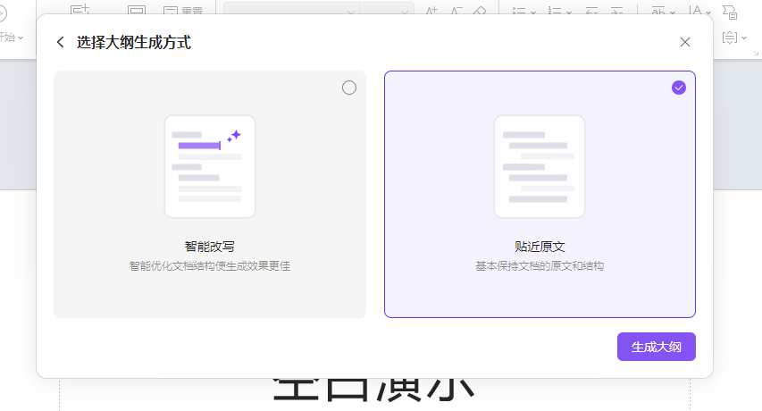

# 提示语
帮我把下文整理成一个大纲, 结构如下; 返回 markdown 代码

    第一章 "共识1的主题"
    
    1. "共识1"的第一个内容
       1.1 "共识1"的第一个内容的第一个节点
       	1.1.1 "共识1"的第一个内容的第一个节点的第一个子项
       	1.1. ...
       1.2 "共识1"的第一个内容的第二个节点
       	1.2.1 "共识1"的第一个内容的第二个节点的第一个子项
       	1.2. ...
       1. ...
    2. "共识1"的第2个内容
       2.1 "共识1"的第2个内容的第一个节点
       	2.1.1 "共识1"的第2个内容的第一个节点的第一个子项
       	2.1. ...
       2.2 "共识1"的第2个内容的第二个节点
       	2.1.1 "共识1"的第2个内容的第二个节点的第一个子项
       	2.1. ...
       2. ...
    3. ....
    
    第二章 "共识2的主题"
    
    1. "共识2"的第一个内容
    2. "共识2"的第2个内容
    3. ....
    

文章内容如下

    - [项目整体运行规划](#项目整体运行规划)
      - [项目实施前期准备](#项目实施前期准备)
        - [需求调研与分析](#需求调研与分析)
        - [资源配置与准备](#资源配置与准备)
        - [项目计划编制](#项目计划编制)
        - [项目启动会](#项目启动会)
      - [系统部署](#系统部署)
        - [环境准备](#环境准备)
        - [软件安装与配置](#软件安装与配置)
        - [代码部署](#代码部署)
      - [调试优化](#调试优化)
        - [系统调试](#系统调试)
        - [优化调整](#优化调整)
      - [整体运行规划](#整体运行规划)
        - [运行维护方案](#运行维护方案)
        - [上线准备](#上线准备)
        - [系统上线](#系统上线)
    - [项目实施背景](#项目实施背景)
      - [采购目的](#采购目的)
      - [重点难点](#重点难点)
    - [数字交易市场](#数字交易市场)
          - [牛只识别模块](#牛只识别模块)
              - [业务需求分析](#业务需求分析-15)
              - [技术实现方案](#技术实现方案-16)
          - [牛只采集模块](#牛只采集模块)
              - [业务需求分析](#业务需求分析-16)
              - [技术实现方案](#技术实现方案-17)

# 导入方法
1. 将 gpt 生成的内容复制到 word, 批量替换 `# ` -> ` ` , 保存
2. 打开 wps, 选择 `演示` -> `WPS AI - 一键生成 PPT`
3. 选择`上传文档`

4. 选择`贴近原文`

5. 校验大纲
6. 选择模板
7. 生成结果